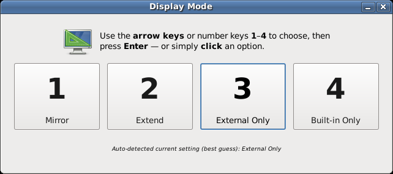

# qdvc-display-toggle

A **quick and dirty, vibe-coded** (QDVC) display-mode switcher (e.g., for MATE desktop), filling the gap left by the absence of a GNOME/Windows-style **Super+P** display popup.



On launch it auto-detects your current arrangement (best guess) and highlights the matching option.

Vibe-coding details in [vibe-coding/](vibe-coding/)

## Usage

```bash
python3 display-switcher.py
```

- **Arrow keys** or number keys **1–4** move the highlight, **Enter** applies.
- Or just **click** an option.
- **Esc** cancels.

Bind `python3 /path/to/display-switcher.py` to **Super+P** in *System → Preferences → Hardware → Keyboard Shortcuts* for the full experience.

## Requirements

- Linux running **X11** (not Wayland)
- `xrandr`
- Python 3 with **GTK 3** bindings (`python3-gi`, `gir1.2-gtk-3.0`)

## How it works

A single GTK 3 script that drives `xrandr`. See
[`MAINTENANCE.md`](MAINTENANCE.md) for the technical details.
